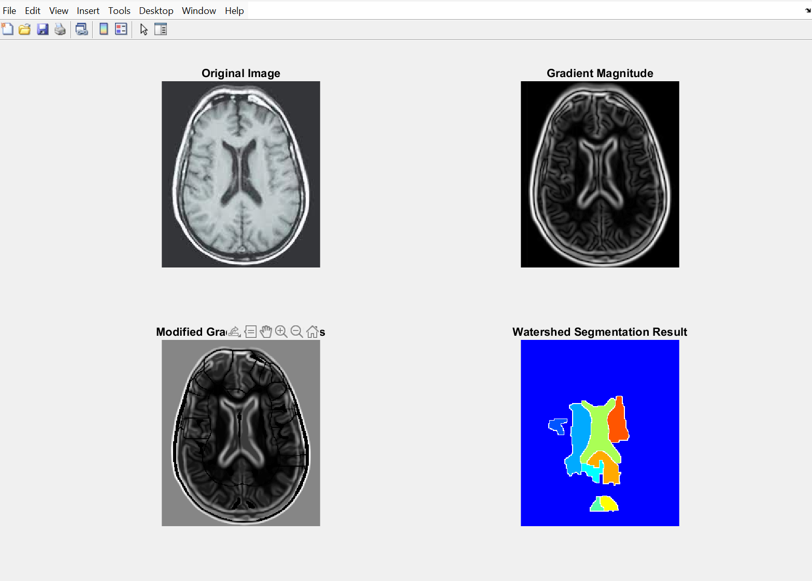
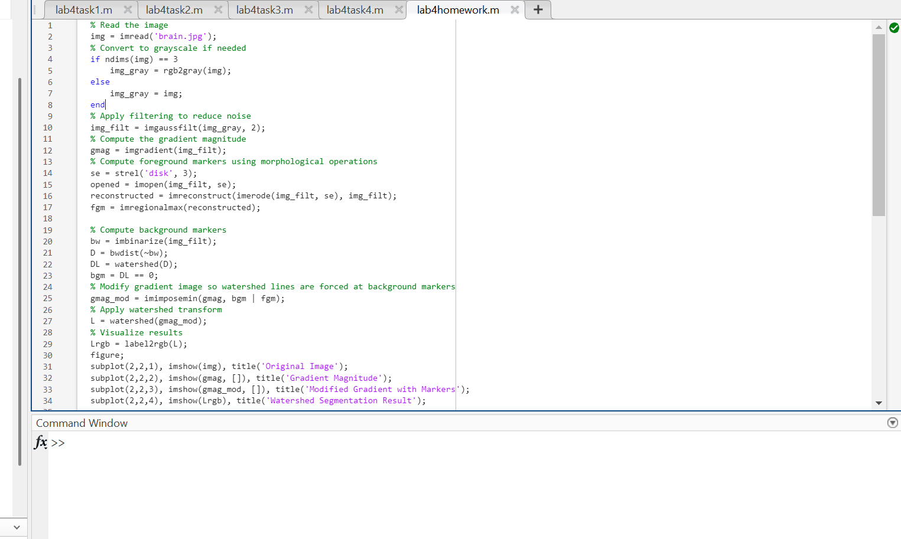

#  BMED469 – Biomedical Image Processing – Lab Homework 4

This repository contains the MATLAB implementation for **Lab Homework 4**, focused on **Watershed Segmentation** from the **BMED469 Biomedical Image Processing** course.

---

##  **Objective**

- **Understand and apply Watershed Segmentation** in MATLAB.
- **Explore preprocessing techniques** (Gaussian filtering, morphological operations).
- **Segment anatomical structures** from a biomedical image (`brain.jpg`).
- **Visualize and analyze results** using watershed lines and labeled regions.

---

##  **Screenshots**

###  **Screenshot 1 – Segmentation Output**


###  **Screenshot 2 – MATLAB Code**


---

##  **Files in This Repository**

| **File Name**        | **Description**                                 |
|----------------------|-------------------------------------------------|
| `lab4homework.m`     | MATLAB script performing watershed segmentation |
| `brain.jpg`          | Input biomedical image                          |
| `Screenshot1.png`    | Screenshot showing segmentation output          |
| `Screenshot2.png`    | Screenshot showing MATLAB code                  |

---

##  **How to Run**

1. **Place all files in the same directory**.
2. **Open MATLAB**.
3. **Navigate to the directory** containing the files.
4. Run the script by typing:

```matlab
lab4homework
